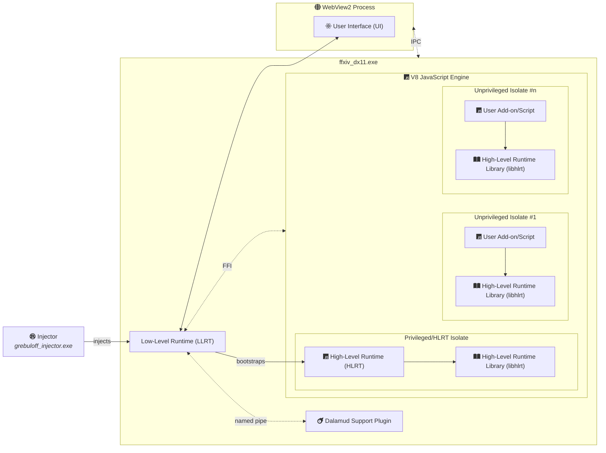

# Architecture

The chart below offers an overview of the general architecture of Grebuloff.
You can learn more about each component by checking out the pages for each
component in the sidebar.

```mermaid
flowchart LR
  injector["
      fab:fa-rust Injector
      <i>grebuloff_injector.exe</i>
  "]

  injector -- injects --> llrt
  web <-. IPC -.-> game

  subgraph game["ffxiv_dx11.exe"]
    llrt["Low-Level Runtime (LLRT)"]

    llrt <-. named pipe .-> dalamud
    dalamud["fas:fa-meteor Dalamud Support Plugin"]

    llrt -- bootstraps --> hlrt

    subgraph v8["fab:fa-js V8 JavaScript Engine"]
      libhlrt["fas:fa-book-open High-Level Runtime Library (libhlrt)"]

      subgraph v8_priv["Privileged/HLRT Isolate"]
        hlrt["fab:fa-js High-Level Runtime (HLRT)"]
        libhlrt["fas:fa-book-open High-Level Runtime Library (libhlrt)"]

        hlrt --> libhlrt
      end

      subgraph v8_unpriv_1["Unprivileged Isolate #1"]
        addon_1["fab:fa-js User Add-on/Script"]
        libhlrt_1["fas:fa-book-open High-Level Runtime Library (libhlrt)"]

        addon_1 --> libhlrt_1
      end

      subgraph v8_unpriv_n["Unprivileged Isolate #n"]
        addon_n["fab:fa-js User Add-on/Script"]
        libhlrt_n["fas:fa-book-open High-Level Runtime Library (libhlrt)"]

        addon_n --> libhlrt_n
      end
    end

    llrt <-. FFI -.-> v8
  end

  subgraph web["fas:fa-globe WebView2 Process"]
    ui["fab:fa-react User Interface (UI)"]
  end

  llrt <--> ui
```
